
<iframe width="720" height="480" src="https://www.youtube.com/embed/pD3NS8fKM2A" title="YouTube video player" frameborder="0" allow="accelerometer; autoplay; clipboard-write; encrypted-media; gyroscope; picture-in-picture" allowfullscreen></iframe>

## Overview

Asthimo was a group project for Biomedical Engineering Skills 2 (ENG 2012), where we were tasked with designing an asthma inhaler for children. Asthimo is a friendly, robot-shaped, customizable inhaler that includes an inhaler spacer in his backpack. Spacers have been shown to improve the effectiveness of inhalers for children, who sometimes struggle with the dual task of pressing down on the inhaler and inhaling at the correct time, because the spacer is able to contain the medicine longer to allow the child to inhale it. Spacers can be important for developing the habit of medical adherence. One of the main reasons for why we designed Asthimo to be cute, colourful, modular, and customizable with many different outfits, is to make the inhaler fun and eye-catching for children aged 6-12, and thus help reduce medical non-adherance for children who regularly need to utilize their non-emergency inhaler for preventative reasons.

## Design Process
#### Group Roles
This was a group project where there was four of us: Me, Alistair, Lucia, and Gabriel. All of us took on different roles, since this project involved lots of moving pieces. I designed two of the costumes - Pineapple and Rocket Asthimo, whereas my group members primarily worked on modelling Asthimo I and II. I modelled Asthimo 0, one of the precursors to Asthimo II. My group members designed the dose counter and the spacer backpack, including the spacer folding mechanism. One of my roles was sketching our team's ideas during the team meetings, since I like to draw. You can see my concept sketches below.

#### Concept Sketches

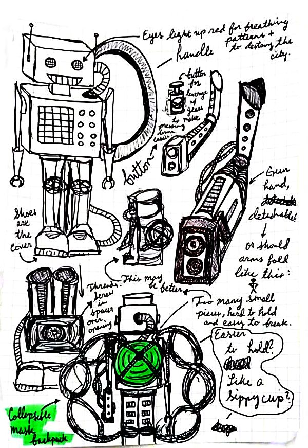

<i>First Concept Sketch from Brainstorming</i>

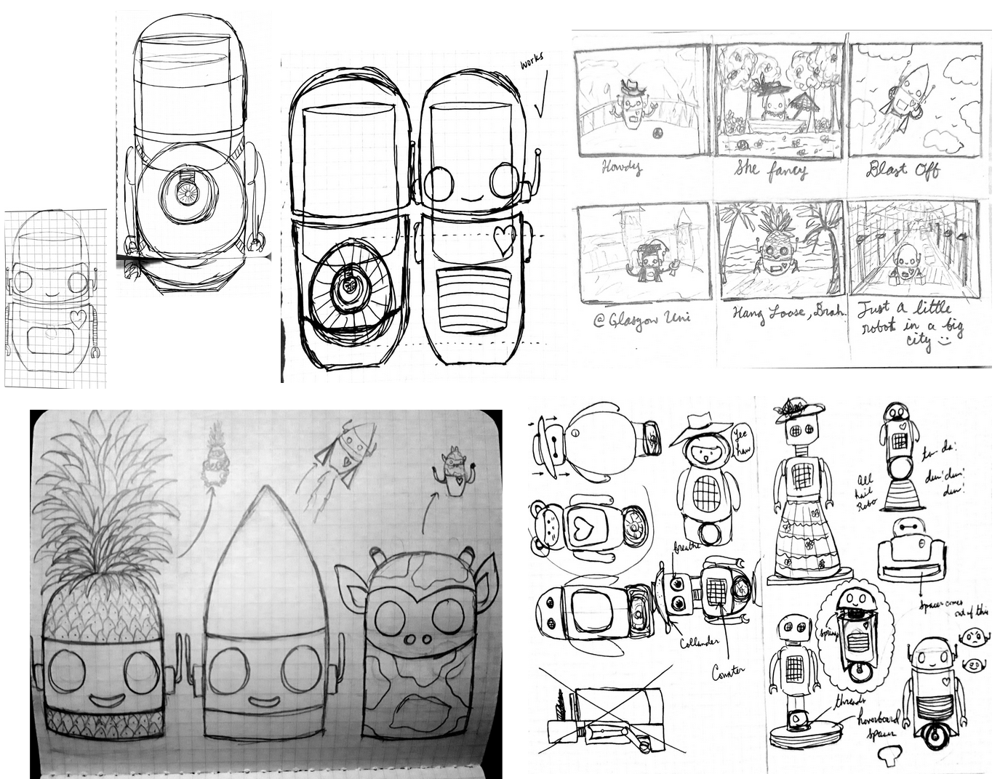

<i>More Concept Sketches</i>

#### Initial Renderings

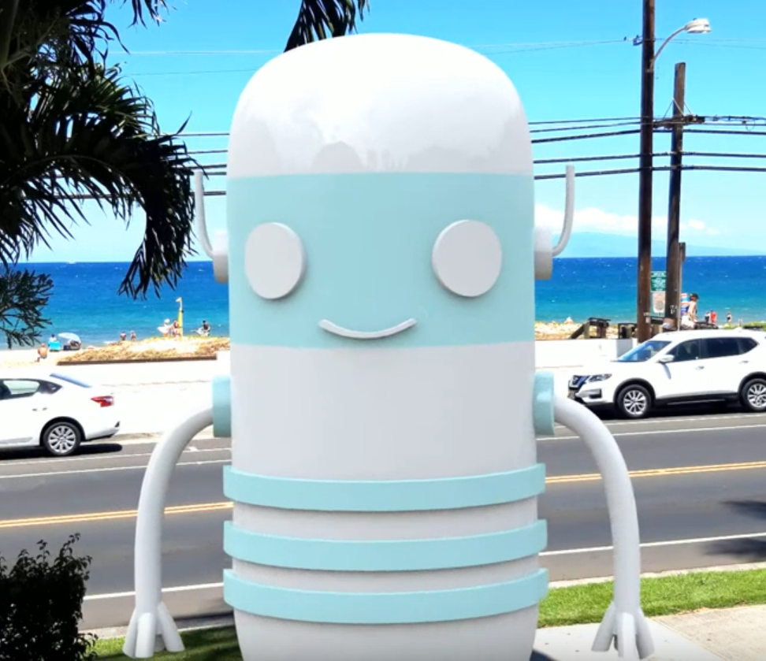
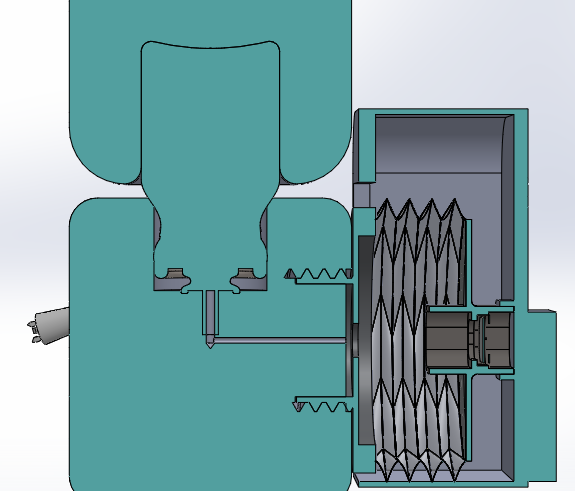
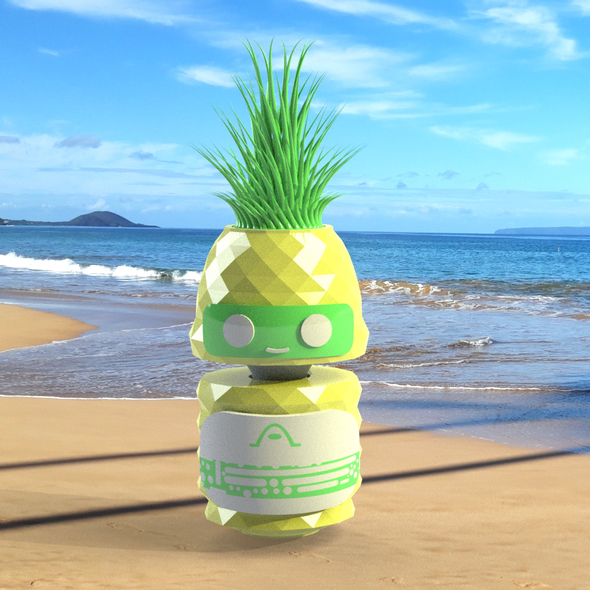
 
<i>From Left to Right: 1) Asthimo 0 - the first Asthimo model used for rendering test animations; 2) Cross Section of Asthimo, showing the inhaler canister and its connection to the mouthpiece, as well as Asthimo's backpack with the folded up spacer attached to the mouthpiece; 3) Square cropped Pineapple Asthimo rendering.</i>

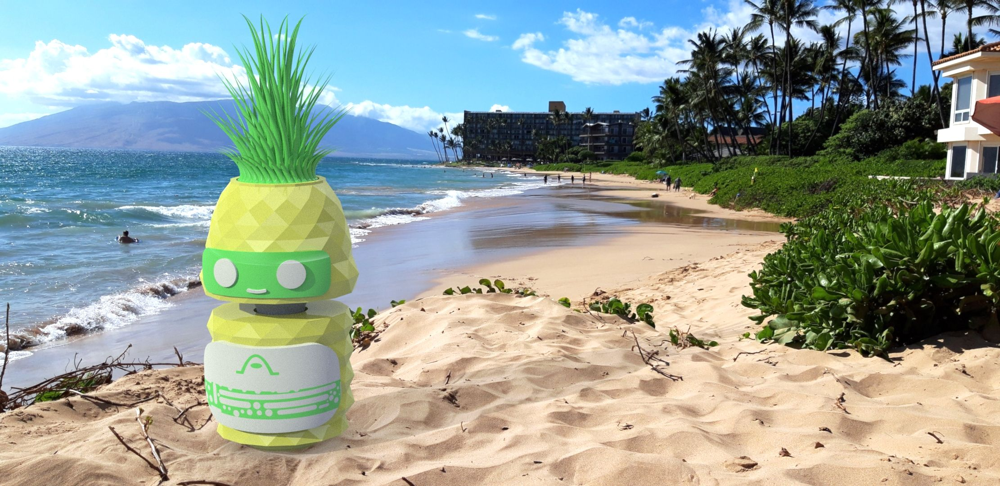

 
<i> Some Asthimo costume renderings, before adding the dose counter, mouthpiece, and spacer backpack. </i>

## Final Renderings: The Many Costumes of Asthimo
Since Asthimo is modular, we designed a lot of different components that the child could put together to customize their Asthimo. The two most consistent features between each Asthimo model is Asthimo's backpack and heart. The inhaler spacer is contained within Asthimo's backpack. The spacer is detachable and the child could choose to use the inhaler mouthpiece located on Asthimo's back without the spacer attachment once they are old enough to inhale the medicine properly on their own. The renderings of Asthimo I show off the unfoldable inhaler spacer. The heart on Asthimo's chest is a dose counter.

Please note that, as previously mentioned, Asthimo is a preventative inhaler rather than an emergency inhaler - Asthimo would only be used for dispensing regular daily asthma medication to the child. The hope is that, with a fun design, the child would be encouraged to use Asthimo, and this would help set the stage for future good habits of taking their medication and preventing medical nonadherance.

#### Asthimo I
Asthimo I is a blocky square robot shape, with a pale blue on white plastic colour scheme. Asthimo I was designed and modeled mainly by my other group members, although as mentioned before, I did help with the original concept sketches.

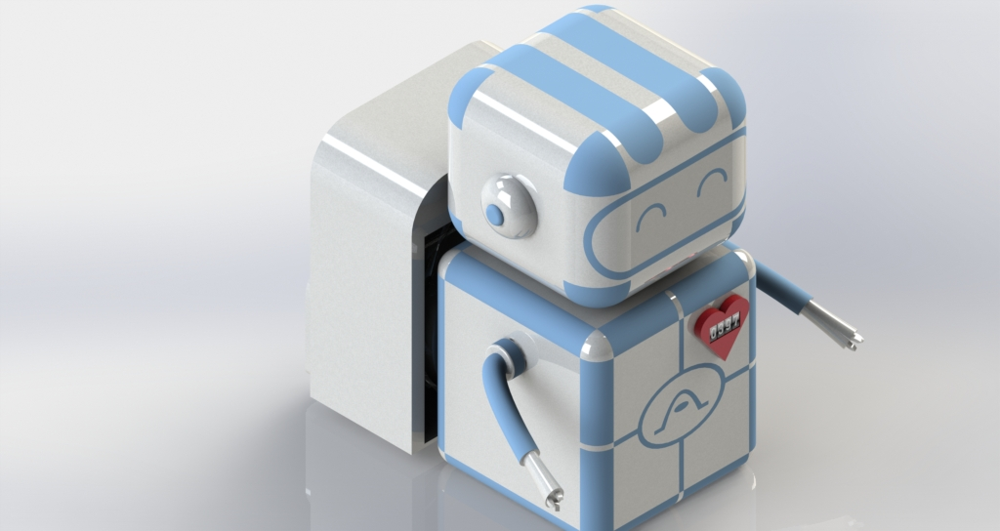
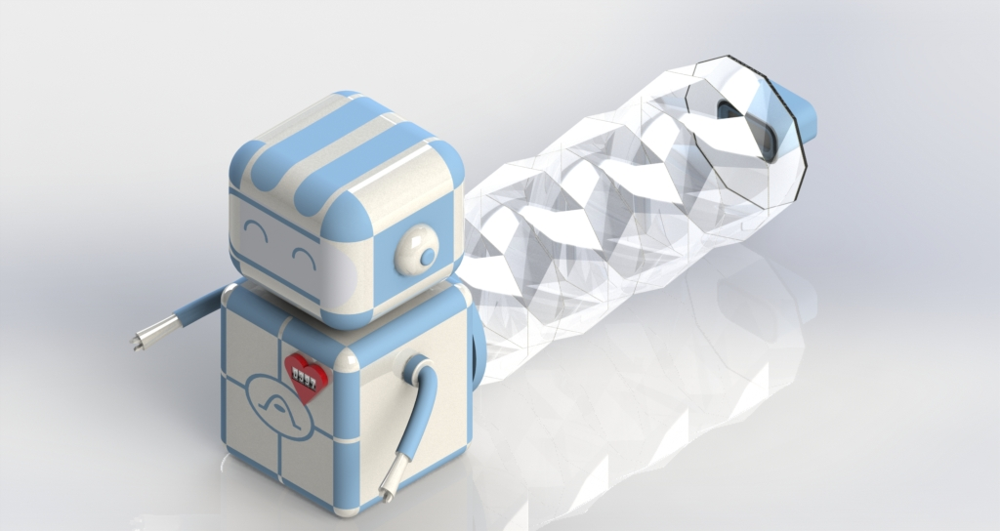

#### Asthimo II
Asthimo II was the final iteration of Asthimo 0, which had the rounded shape rather than the square, box shape. The overall shape of the robot stayed the same, although the robot head was rounder and less flat on top. The antenna shape shape and design remained mostly the same, although I believe we decreased the length slightly so that the antennae wouldn't stick up as far. Instead of having the facial features extruded from the face, the features are at an equal level with the rest of the face, making the entire face smooth and consistent across.

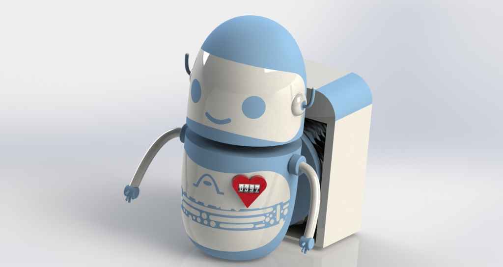
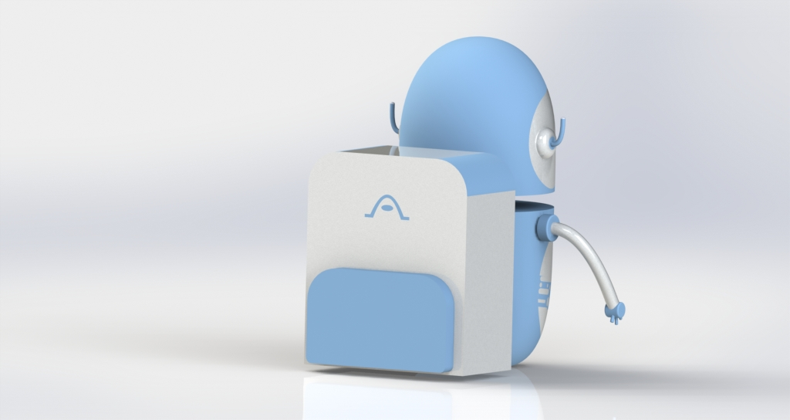

#### Rocket Asthimo
I designed the Rocket Asthimo costume with the hopes of capturing the imaginations of children who love robots, space, and science fiction. Rocket Asthimo's head looks like the nose of a rocket, painted a bright rocket red like a model rocket. The two handles on the side of the rocket head are designed to allow the child to press down easier, with more leverage, on the inner inhaler canister. Asthimo's arms are shaped like rocket booster nozzles, since I wanted to be able to incorporate some sort of rocket booster nozzle element into the design so that the animation could involve Rocket Asthimo "blasting off" and traveling somewhere. Since Asthimo does not have feet, his arms became the rocket booster nozzles instead. I figured that children would enjoy using Rocket Asthimo for imaginative play, or as an action figure on the shelf in their room.

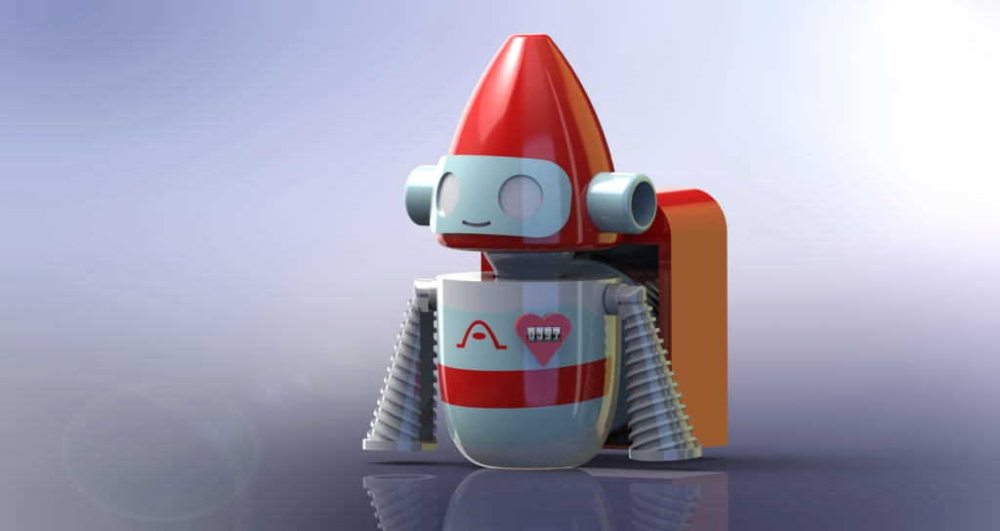
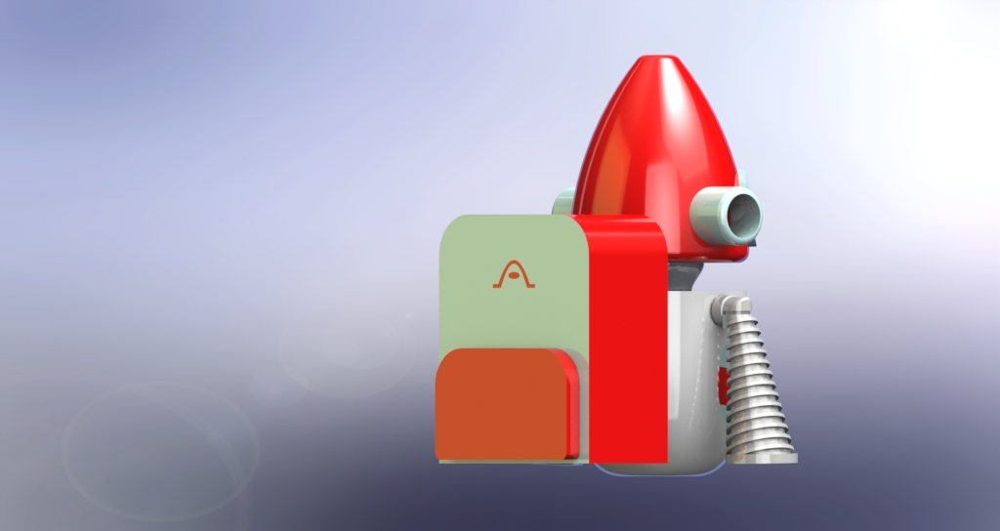

#### Pineapple Asthimo
I also designed a pineapple-shaped Asthimo costume, which does not contain detachable arms and deviates slightly from the typical robot look and feel of the previous costumes. The first thing to note about Pineapple Asthimo is that the tall green pineapple crown is removable, and indeed meant to be removed before use. The top of Pineapple Asthimo's head is then just a flat surface that is easy for the child to press down on. The crown is just a decorative feature that can be left on Asthimo when it is on display on a shelf or a table in the child's room; since the hope is that Asthimo could double as a cool action figure that children would want to show off to their friends.

## Design Board
Our design board drew inspiration from the design of old science fiction magazines - such as Analog Science Fiction and Fact, Asimov's Science Fiction, Galaxy, Amazing Stories, etc. We made sure to highlight all of the key features of Asthimo such as the spacer and the modular customizable design, as well as important information such as dimensions, intended age range, and the warning disclaimer to remove the arms and accessories before use. We decided to use Asthimo II on the cover of the magazine, since they look the most like a rounded Asimovian robot - such as those from I, Robot or Robot Visions.

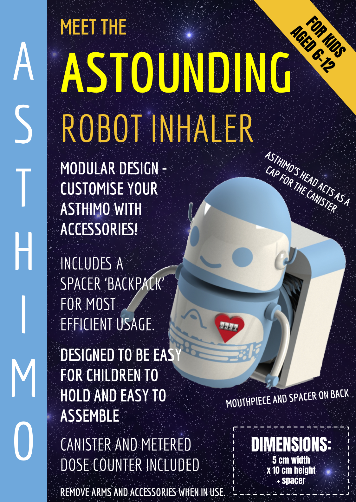

 

Below: Old science fiction magazines, such as the ones that inspired the overall look and feel of the design board.
 
 
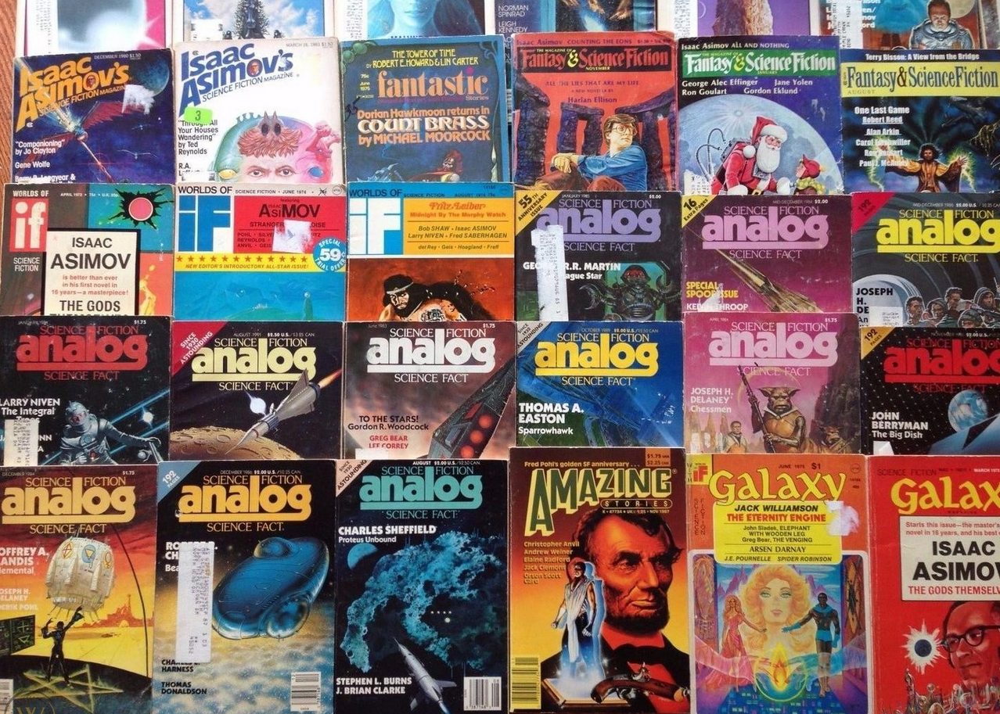
 
<i>Image source: https://thumbs.worthpoint.com/zoom/images4/1/0615/15/lot-63-vintage-science-fiction-galaxy_1_da3dbd4e0809b6020e26182c91020261.jpg</i>

## Faster Solidworks Renders and Citizen Science
Partway through this project, the coronavirus pandemic and subsequent lockdowns occurred, meaning that it was now impossible to get to the engineering computer labs to render our models. We tried to use the remote desktop service, but this service started crashing under the weight of so many students trying to access it. Even prior to the pandemic shutdown, I had been experimenting with using a Microsoft Azure GPU Virtual Machine to render the Solidworks Visualiser images and animations, because the engineering computers would take hours and hours to render, often with hiccups. I would connect to the engineering school computers remotely and leave them rendering overnight; the simplest, shortest animations could still take seven hours to render fully. I found that the Azure GPU rendering was significantly faster - an animation that took 7 hours to render on the university computer was rendered within 17 minutes on the virtual machine. This phenomenal performance was because the Azure GPU VMs used a NVIDIA Tesla M60, a graphics card often used for high-performance computing. The best part was that this method was free, thanks to the $100 of Azure credit provided to students by Microsoft (through Azure for Education). After signing up with my student account and setting up the VM, all I had to do was make sure that the machine was completely stopped and powered down at the end of each session, so that I was only using as much credit as I needed.

Then, the pandemic hit, and I found out that many of my peers in my year group were having trouble accessing the university computers in the first place. I decided to write a document detailing how to create my same setup themselves so that they could also render their Biomedical Engineering CAD coursework without hiccup. I then added a citizen science aspect, of using Folding@Home to help contribute the leftover computing resources from the powerful virtual machines to helping finding potential solutions for the coronavirus pandemic. Many of us second-year biomedical engineering students felt quite helpless about how we could contribute when the pandemic first hit, and I thought that the citizen science aspect was a pretty solid way to help. As the document became longer and longer, I decided that it would be best to just publish it as an article on my medium account, then send the link to the 2nd year Biomed group chat. Since then, it has reached a larger audience than I originally intended, and someone even commented on it years later. This was, unintentionally, my first published piece of technical writing, and it made me interested in writing more technical articles sometime in the future.

You can read the article here: <a href="https://sophiandavis.medium.com/faster-solidworks-renders-and-citizen-science-c43a37f120fc">Faster Solidworks Renders and Citizen Science Article</a>
