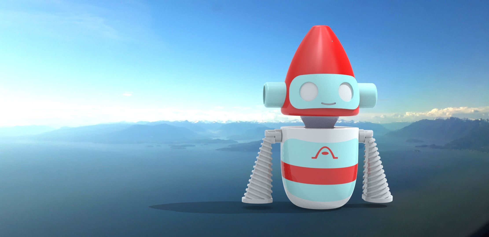

<iframe width="720" height="480" src="https://www.youtube.com/embed/pD3NS8fKM2A" title="YouTube video player" frameborder="0" allow="accelerometer; autoplay; clipboard-write; encrypted-media; gyroscope; picture-in-picture" allowfullscreen></iframe>

## Overview

This was a group project for university, the Biomedical Engineering Skills 2 (ENG 2012) asthma inhaler project. My group designed Asthimo, a customizable and kid-friendly, robot-shaped inhaler for children aged 6-12.

- Why I am proud of it / included it in the portfolio
- Important Links (to demos, etc. if applicable and if the sample is not able to be embedded)

## Design Process

- Describe the process of designing this project
- Images of important design elements
- Descriptions and justifications for important design decisions
- Include sketches, previous drafts, all design documentation
- Show everything leading up to the final design, talk about all the hard work that went into the final product

First Concept Sketch from Brainstorming

More Concept Sketches

## The Future

- Talk about any future plans or improvements that you would make on the final product, or...
- Alternatively, talk about how the skills learned from this work will help you in your future career.
- Maybe show personal growth & improvement here.

## Skills and Software Used

- List the skills and software used for this project

## Additional Links and Resources

- List additional links, bibliography, etc
