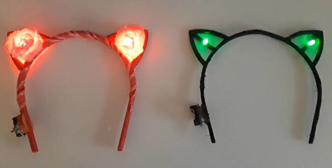
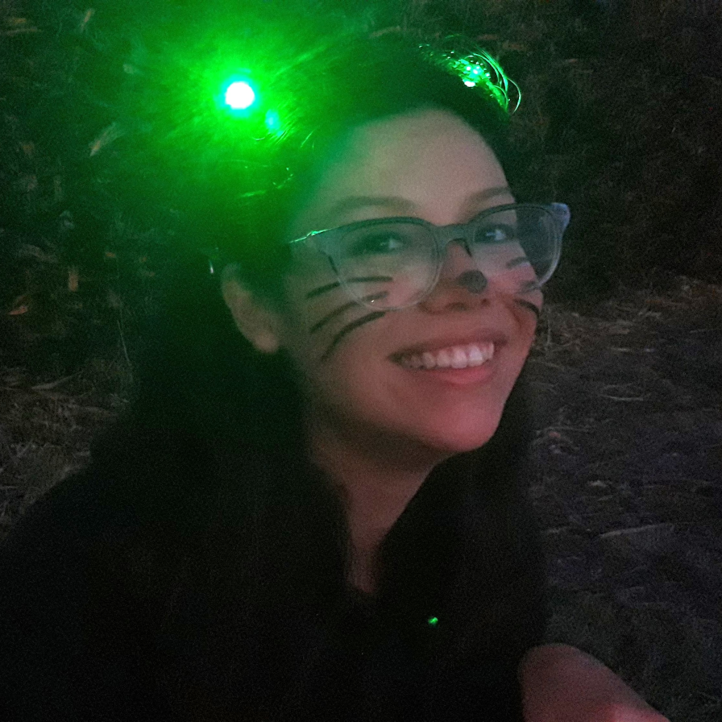
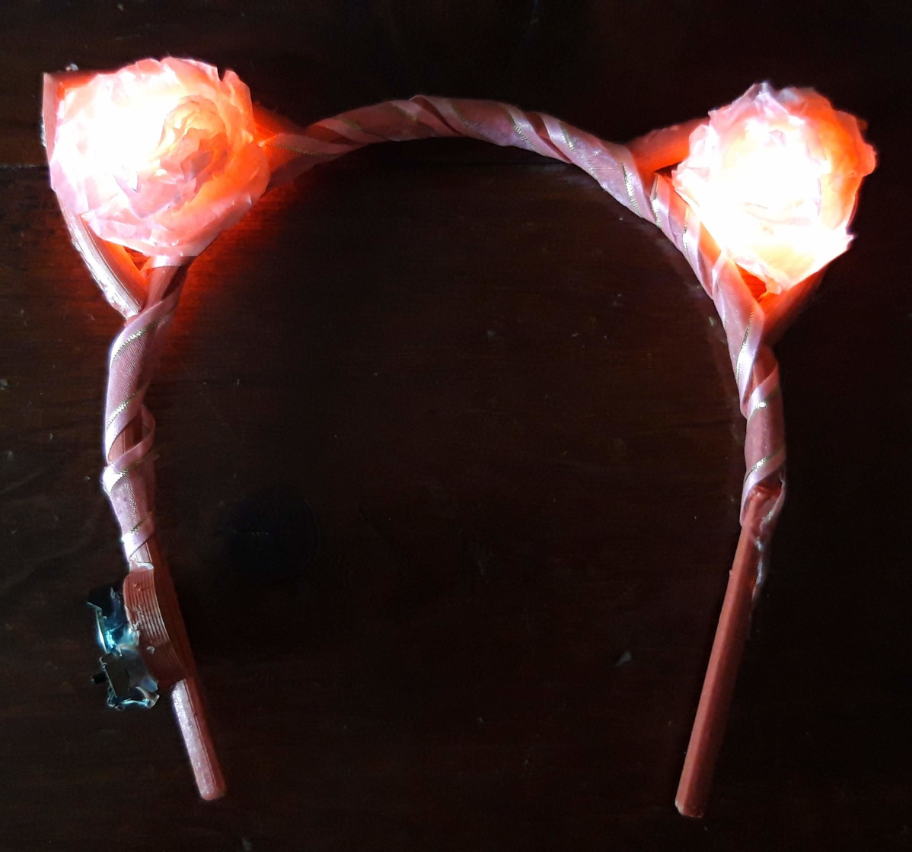
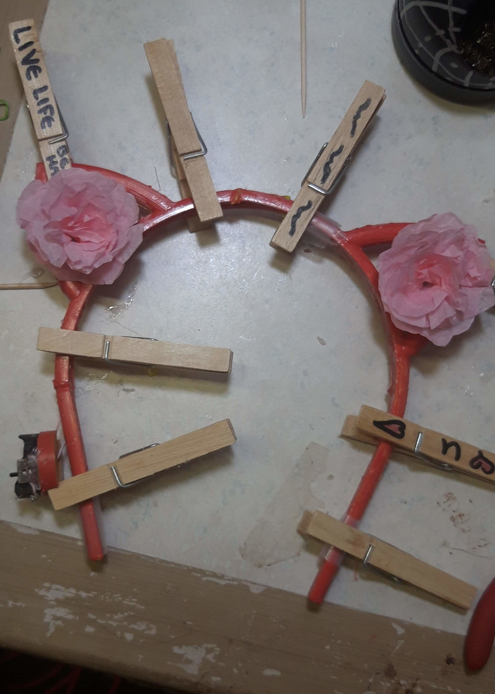
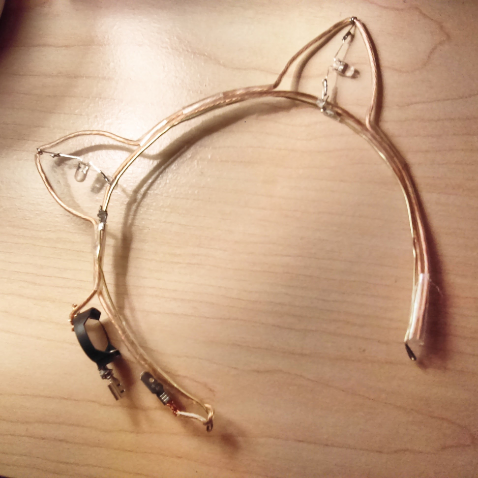
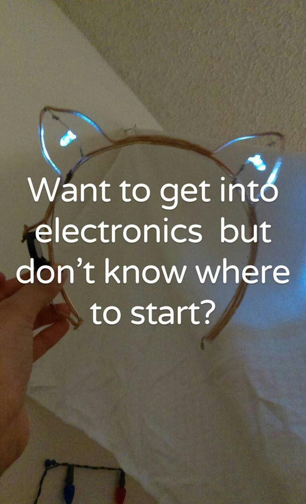
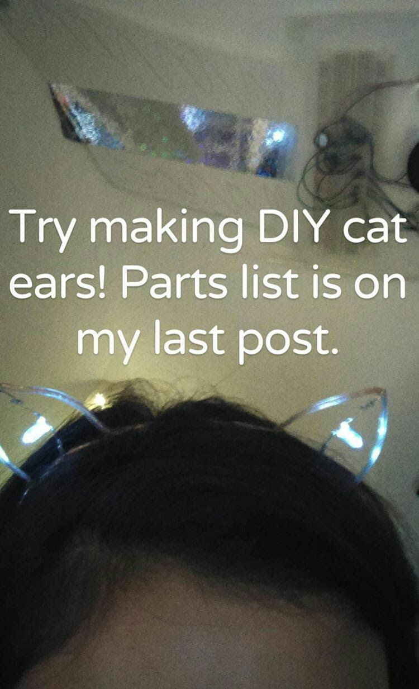
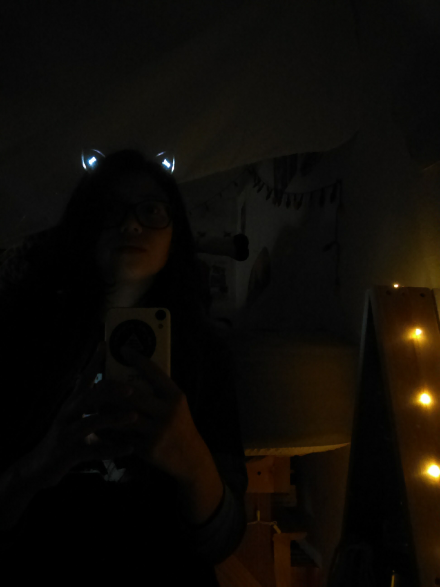
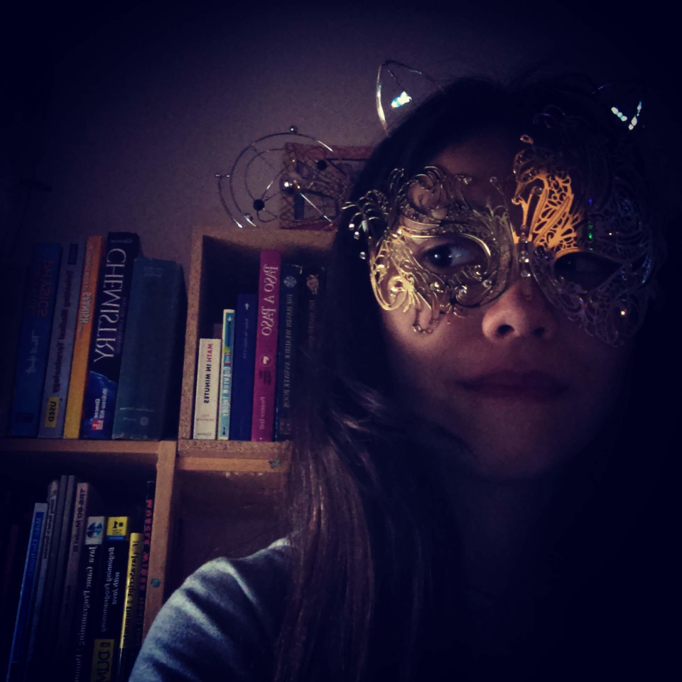

<iframe width="840" height="473" src="https://www.youtube.com/embed/vHotMhFMeg0" title="YouTube video player" frameborder="0" allow="accelerometer; autoplay; clipboard-write; encrypted-media; gyroscope; picture-in-picture" allowfullscreen></iframe>

## Overview
This page is still a work in progress.

## Version 2.0

### Green LED with Black Frame Version
Created: **September 2020**

### Red LED with Pink Frame and Flowers Version
Created: **October 2020**

## Version 1.0
Created: **January 28, 2017**

So if I remember correctly, after all these years, the story goes like this. One night when I was a Junior in high school, I had a lot on my mind and I couldn't sleep, so I pulled an all-nighter and made myself a pair of light-up cat ears. Then I posted about it to Instagram.

 
<i>I did put the parts list on my Instagram, but never got around to making the Instructable.</i>

Cat Ears V1.0 was my absolute favorite accessory as a teenager! I would wear the headband everywhere - to school, to the supermarket, on the bus, on dates, literally everywhere. Especially on days when I needed extra confidence (such as for a Calculus quiz), or for parties/holidays like Mardi Gras. I even wore them some days when I was up at the front of the room teaching the CodeKCS class in Senior Year.

 
<i>From left to right: Wearing my cat ears in my cozy bedroom; Wearing my cat ears as a good luck charm before a quiz; Wearing cat ears on Mardi Gras at home (last two images). </i>

 
<i>I was sixteen years old when I made these ears. I was - and still am - absolutely obsessed with cats.</i>
 
<i>The cat shown in the video was our beloved cat Rumba.</i>
 
<i>Rumba, you are so very loved and so very missed.</i> :heartpulse:
 
<i>You were the light in my life amid so much darkness, and the reason why I am still here today.</i>

