
<iframe width="720" height="480" src="https://www.youtube.com/embed/B3gHXCdYnr0" title="YouTube video player" frameborder="0" allow="accelerometer; autoplay; clipboard-write; encrypted-media; gyroscope; picture-in-picture" allowfullscreen></iframe>
 
<i>The original cell town video assignment - created in 2015.</i>

## Overview
Cell Town started as a biology assignment in high school - I built it from scratch in Google Sketchup when I was 14 years old. I am revisiting it now as an adult studying biomedical engineering, with the question of how digital tools and analogies can be used to help teach complicated topics such as biology.

I wonder, how can we envision, simulate, approximate, and animate the inner workings and complexities of very complicated things such as cells? Could we take things such as vesicle transport and enzymatic reactions and DNA replication - and make these concepts come alive? Can we create virtual worlds that allow students to literally explore a cell or a cell analogy?

I know that biomedical engineering - and particularly synthetic biology, cell-based biosensors, and cell-component based bio-computers - are all going to play a major role in the future of humanity. And from my own experiences as a student, knowing how complicated and overwhelming it can be when you are first exposed to topics like cellular and molecular biology, it all makes me think about how we can lay a good foundation for young students regarding these increasingly relevant yet complex topics.

To me, it feels like part of the answer could be engaging content creation, as well as leveraging new frontiers such as the metaverse. Sort of like, gamifying learning biology - what if it was like a video game or a puzzle game? And there are parallels between that and scientific research. Biology is a complex puzzle that scientists are still trying to unravel and solve, and probably will be forever or for at least the foreseeable future.

That brings me to my last point about the potential of using the metaverse as a teaching tool - what if it could also be a tool for connection between eager, curious students and scientists who can visit virtual spaces to present their work. What if connection and learning in a virtual space - interaction between students and academics anywhere in the world - could result in real-life, real-world mentorship?

There will be a lot of work to be done, such as optimizing metaverse spaces for lower-resource environments where computer hardware and internet speeds could be significant barriers - this includes many schools, which may have outdated computers, without powerful graphics cards. However, I think there is a lot of potential here, and there are already some browser-based metaverse platforms that have made significant leaps in that area - and that is why this is something I have chosen to dedicate more time and energy and thought to.

I have been working on creating new Cell Town renderings and animations in Blender, a powerful 3D animation software, to help make the original model come even more alive. I have been looking into how I could make an improved version of the original model and video that includes more complex topics and elaboration into the functions of the various organelles. Finally, I have created a metaverse space based on the original model using the Mona metaverse platform, and am hoping to create an even more interactive metaverse space for the new cell model as well when it is completed - with this space, I aim to incorporate some of the elements I touched on before about creating a metaverse space optimized for interactive, engaging learning, collaboration, and mentorship.

The Cell Town V1.0 metaverse space is still in the process of finalization and quality assurance, however, the link will be available on this page once it is approved and live online. If you would like to walk explore the Cell Town Space right now, you can do so by uploading the Playground Files to the Monaverse Playground Space (see guide <a href="https://github.com/TheGiraffe/VisitCellTownV1.0">here</a>). Finally, as part of the Monaverse workflow, all of the live iterations of the Cell Town Spaces will be minted as NFTs.

## Design Process of Original Cell Town Video
The process of designing the original cell town began with a lot of research. There were several things to look into, right off the bat. Firstly, I needed to do independent research on the functions of the various organelles of the cell, to ensure that the analogy made sense and that the content was factual. Secondly, because I had decided early on that my theme would not just be comparing cells to a regular town, but to a town of the "future", I researched a lot of news articles of promising inventions and ideas that could change urban landscapes.

*Some personal context here is that, when I was a young teenager, I was very passionate and excited about what the future could look like, I was excited about the idea of "futurism" and how current scientific research will shape the landscape of the future. I liked to think about what the world would look like in the year 2100, and spent a lot of my time visiting a website called Futurism that focused on emerging technology (in fact, I created a raspberry pi wall projector alarm clock for my bedroom that had an embedded Futurism feed).*

After the research phase, I began the sketching phase, where I individually sketched out the building/urban feature analogy for each organelle. Unfortunately, I do not have any high quality photos or scans of the sketches, but luckily, I have this video that I captured for the end credits of my original cell town video:

<iframe width="560" height="315" src="https://www.youtube.com/embed/ebp_2XhySIw" title="YouTube video player" frameborder="0" allow="accelerometer; autoplay; clipboard-write; encrypted-media; gyroscope; picture-in-picture" allowfullscreen></iframe>

After sketching phase, I started to individually model each organelle analogy, in separate Sketchup files. I used google images to source textures to bring each model to life, and I created the base file that would eventually encompass the entire cell town with all of its organelles. During the modelling process, I also started considering how I wanted the overall information flow of the video to behave. I added three dimensional text descriptions to some of the models, as an extension of the subtitles that I knew I would include in the final product.

Once all of the organelles were modeled and imported into the main Cell Town file in Sketchup, I started Animating. In Sketchup, you can create "animations" that allow you to wander around and explore the model. I orbited and panned around the model and used the animation tab to save each position and transition. I recorded and exported some rough clips of the general flow of the video that I would like to achieve, and iterated until I found a flow that worked well. I was especially trying to be mindful of preventing the experience from being dizzying for the user.

The final step was editing the video in Windows Movie Maker, adding the subtitles, credits, and royalty-free music. As part of preventing the video from being dizzying, I chose to have the clips of the model be nested within a thick black border, with the subtitle text in a large font on the bottom edge. I wanted the viewer to be able to focus on the subtitle text, since the subtitle text provides a lot of the context for the video, which is why I chose not to overlay the text directly on top of the model and opted for the thick border instead. I chose the song "Adventures" by A Himitsu because I wanted a calm but dreamy and adventurous feel to the video - I wanted the viewer to feel like they are exploring a dreamy town of the future while learning about organelles in the process. At the end of the video, I made sure to include some of the news links that inspired some of my models, as well as image credits for the various textures I used.

## Impacts of the Original Design
Years after I created it, this cell analogy video has been used by teachers at my high school as a resource for introducing the cell and organelles.

My high school biology teacher, Ms. Wilson, was especially very supportive of my work: After telling me how much she loved the video, she really encouraged me to continue to follow my curiosity and see where it leads me, and to see what I learn along the way. She would often send me links to interesting opportunities in science education, from summer schools to research vessels, and although my life circumstances at the time prevented me from pursuing those opportunities, I really credit her with inspiring me to dream big.

If you would like to read some of my original thoughts and insights from this project, this link contains a reflection on the work sample that was written back in 2015, a couple months after I completed the project: <a href="http://seniorprojects.sophiaisfabulous.com/worksamples/worksample4.html">Sophomore Year Work Sample Writeup</a>

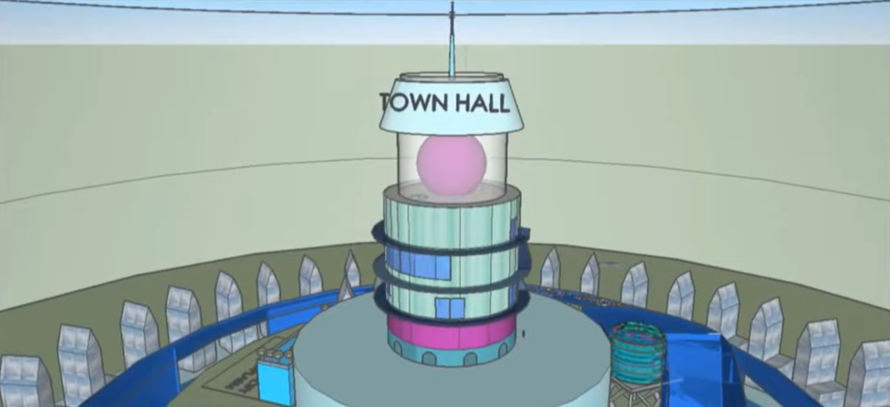

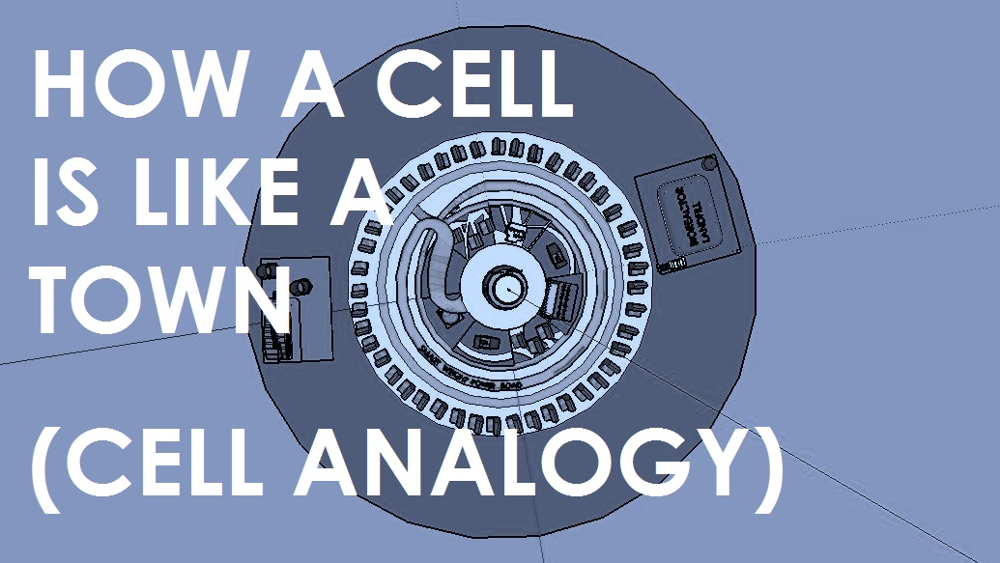

## Revisiting Cell Town
For years, I had wanted to revisit the Cell Town project and look into ways to further the concept as a teaching tool. My idea was to import the model into Blender, or potentially recreate it entirely in Blender, and create animations of different cellular processes to help students visually understand how these processes work. I was also interested in completely rebuilding the model and changing some of the analogies (such as changing the Mitochondria analogy from a nuclear plant to something else, as my views on nuclear energy have shifted since I created the original model). I also had some interest in creating separate animal and plant cell models, and creating an extended version of the original video.

As I was considering these ideas, something else happened - I was introduced to the concept of building for the metaverse through a platform called Mona. This opened the door to many new possibilities and ideas regarding how immersive virtual worlds can help students better understand biology; I've touched on many of these ideas above in the Overview.

In 2022, I was able to start working on implementing these ideas. The first step was importing, editing, and rendering the original model in Blender.

### Importing into Blender - First Attempts

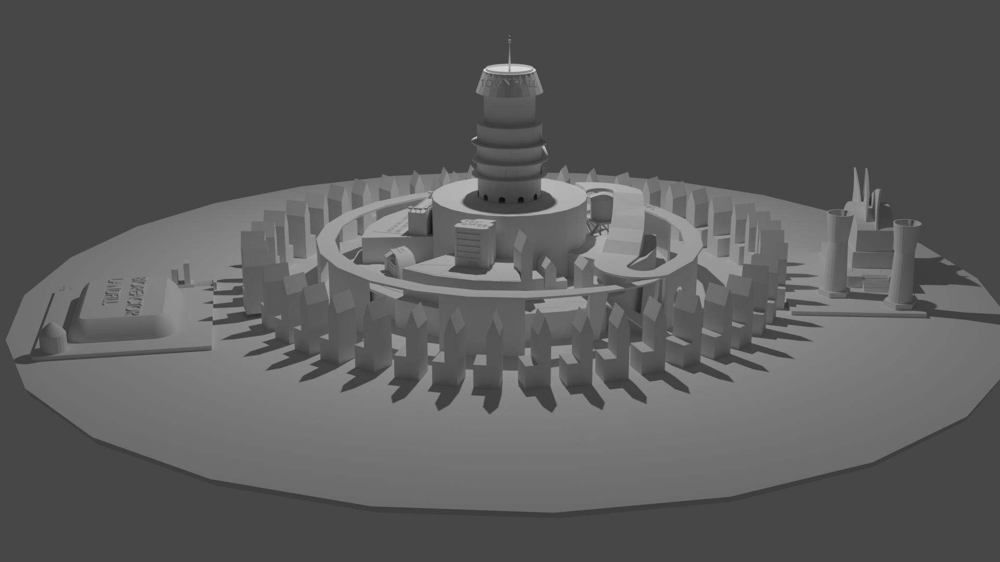
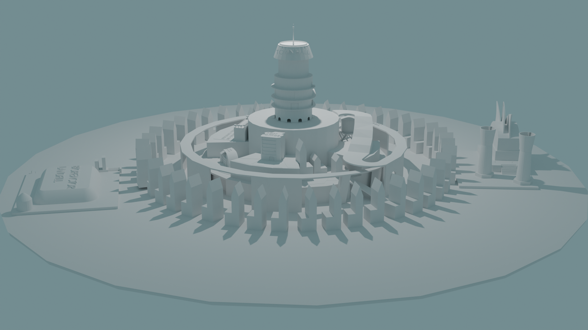
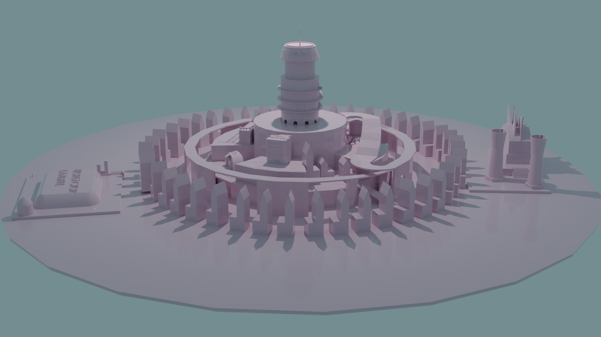
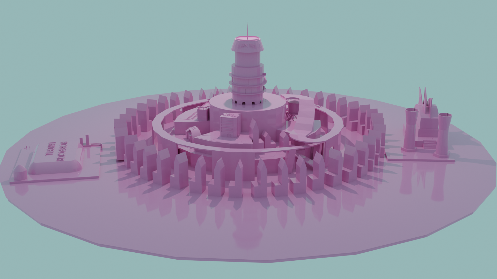

The first attempt at importing the model into Blender involved using an STL version of the Sketchup model. The results were interesting: I was able to generate something that looked like a plastic model of Cell Town, with everything connected as one solid piece of the same material. This opened up the possibility of potentially 3D printing the original model of Cell Town (known as V1.0) - or potentially a recreated and optimized model later on down the line - with the possibility of using it as a tangible classroom aide or small art installation.

### Second Blender Attempt + Materials, Environment, & Rendering
The second attempt at importing and rendering Cell Town V1.0 in Blender involved exporting the original model as a .dae file instead, thus preserving some of the textures and, most importantly, the separate components of the model (rather than molding them altogether). After adding materials, then changing the environment, lighting, and other settings, I was able to create some colourful, complete renderings of Cell Town V1.0. Notably, I did not include most of the image textures in the original model, as I wasn't sure whether any of the images had been Creative Commons - I figured that solid colour textures worked just fine for this attempt.

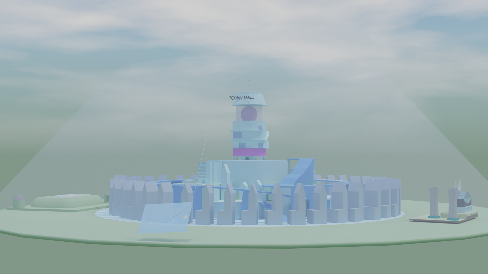
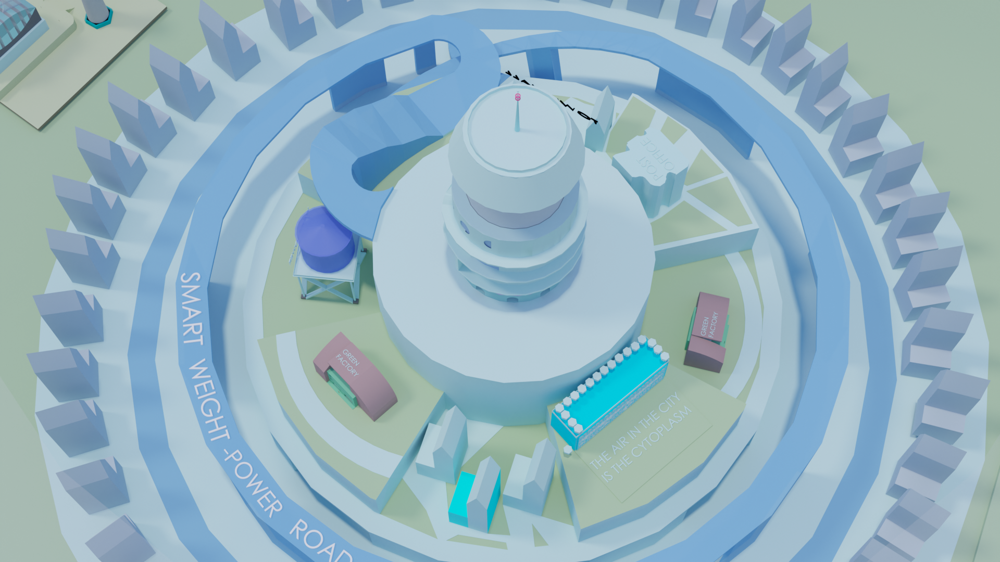

### Vesicle Transport Animation

My first set of Blender adventures for Cell Town V1.0 concluded with creating a simple animation that could help illustrate vesicle transport along the endoplasmic reticulum. The endoplasmic reticulum (aka E.R. - and the "road" in this analogy) has ribosomes on the Rough E.R. that synthesize proteins, which are then sent off in transport vesicles to the Golgi Apparatus.

For this animation, I just wanted to try animating little circular transport vesicle "cars" commuting along the road, because getting the vesicles directly to the Golgi Apparatus analogy (the "post office"), would be difficult using the road model I built. Furthermore, the Ribosome analogy, the "green factories", are also out of reach from the road, even though that is where the proteins being transported by the vesicles would be created.

Both of these issues highlight the fact that, in order for any animated organelle function analogies to make sense, there is a need to recreate the Cell Town model with a different layout. The layout of the original model made sense because the assignment only required an analogy for each organelle, not so much an analogy for their interconnected functionality.

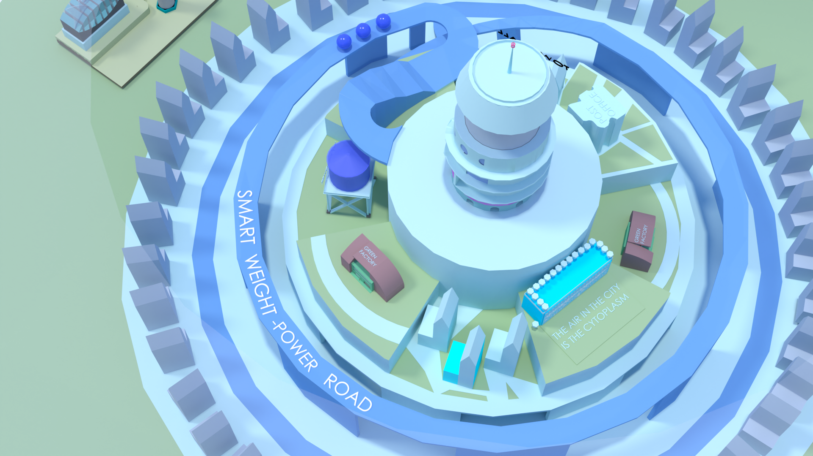
 
<i>First rendered frame of the Cell Road example animation.</i>

These realisations more or less concluded my animation work with the original Cell Town model, and I am currently working to design a more interconnected Cell Town, which better represents the interconnectedness of a real cell. I am still proud of the transport vesicle "cars" along the endoplasmic reticulum road animation, because it is my first fully rendered attempt at using animation and analogies to describe a specific functionality within a cell - particularly, for a concept that can potentially be more advanced than middle-school / early high-school level. You can see the rendered video version of the Cell Road animation below (better quality than the GIF above):

<iframe width="560" height="315" src="https://www.youtube.com/embed/yQ9JUH_FVTE" title="YouTube video player" frameborder="0" allow="accelerometer; autoplay; clipboard-write; encrypted-media; gyroscope; picture-in-picture" allowfullscreen></iframe>

### Unity, Virtual Worlds, and the Monaverse
Finally, I wanted to be able to create a metaverse model from the Cell Town V1.0 model, and be able to explore it with my Mona avatar. I edited the model in Blender, then exported it as a FBX file. I then imported that file into Unity and got to work on scaling, adding mesh colliders so that the avatar would have places to stand on within the model, customizing the environment and lighting, adding the placeholders for Mona-specific items (Canvases, Artifacts, Portals, Spawn Points), tweaking materials, and - the most fun part for me - adding animations. While I was trying to keep the model as true to the original as possible, I did make one significant allowance: I added and animated an elevator that takes the user up to different levels of the nucleus "Town Hall" tower, because the original model had no continuous ramp or method that would allow an avatar to get to the top of the nucleus.

*(Obviously, I didn't create the original model thinking that this kind of avatar-friendly functionality would be needed, but I was surprised at just how continuous and avatar-accessible much of the original model was to start with - the cell road, for example, already stretched all the way from the base of the model to the nucleus building's platform)*

You can see a video of my avatar exploring the space below:

<iframe width="720" height="480" src="https://www.youtube.com/embed/5VABailxDvM" title="YouTube video player" frameborder="0" allow="accelerometer; autoplay; clipboard-write; encrypted-media; gyroscope; picture-in-picture" allowfullscreen></iframe>
 
<i>Video run-through of me trying to navigate through the Cell Town Space. Obviously, I do not have much gaming experience, so my ability to run with arrow keys is still elementary - apologies if this causes the video to feel quite slow at some points. For the items like Canvases, Artifacts, and Portals, the content or functionality gets customized after being submitted, hence why they are blank in the Mona Playground.</i>

 

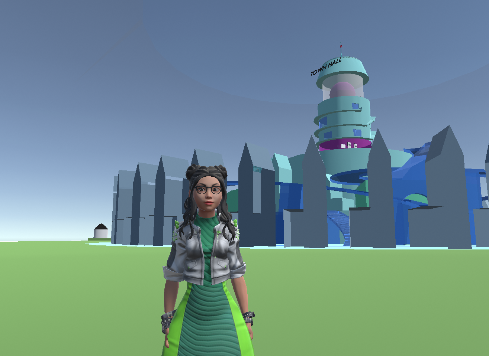
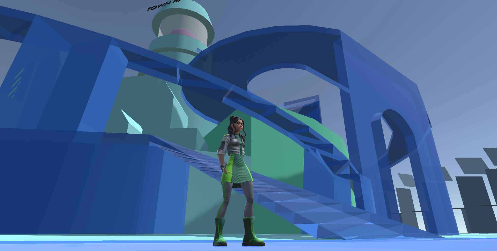
 
<i>"Sophia in Cell Town"</i>

