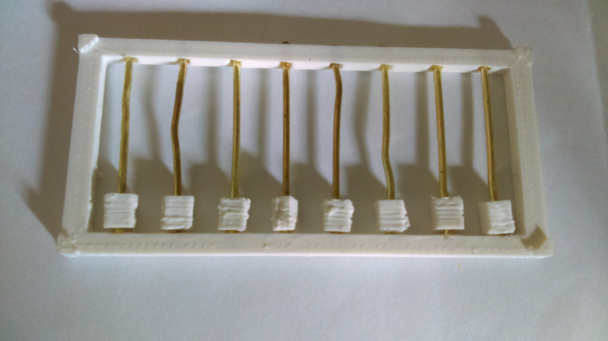
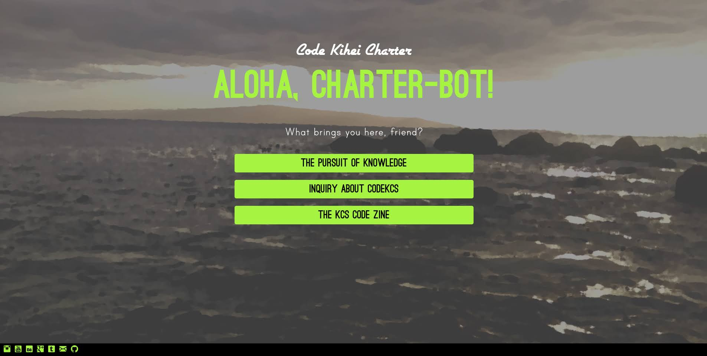
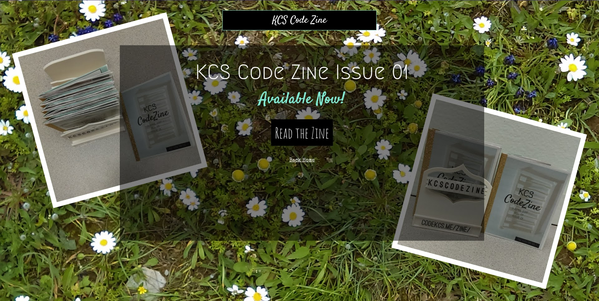
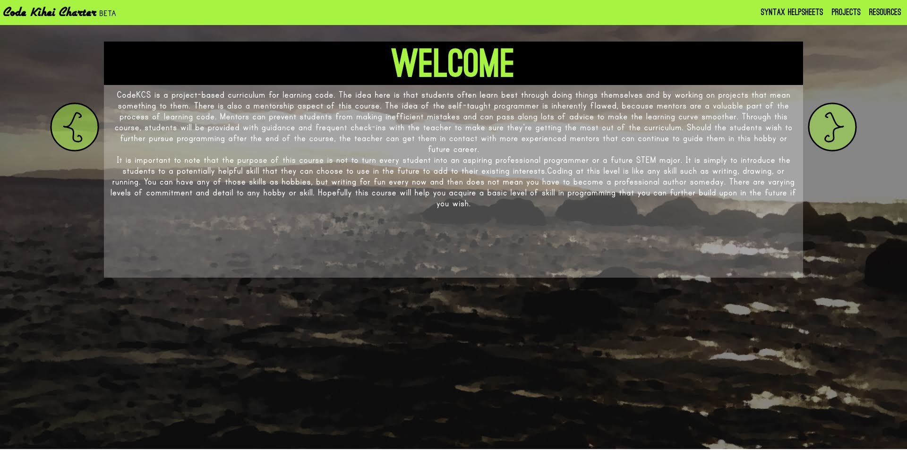
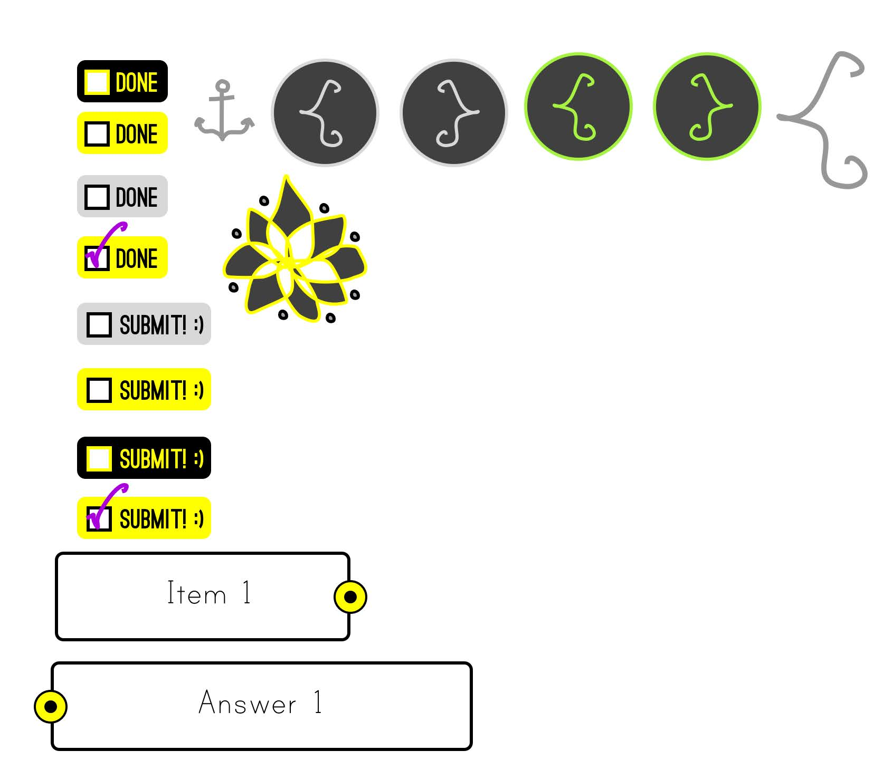
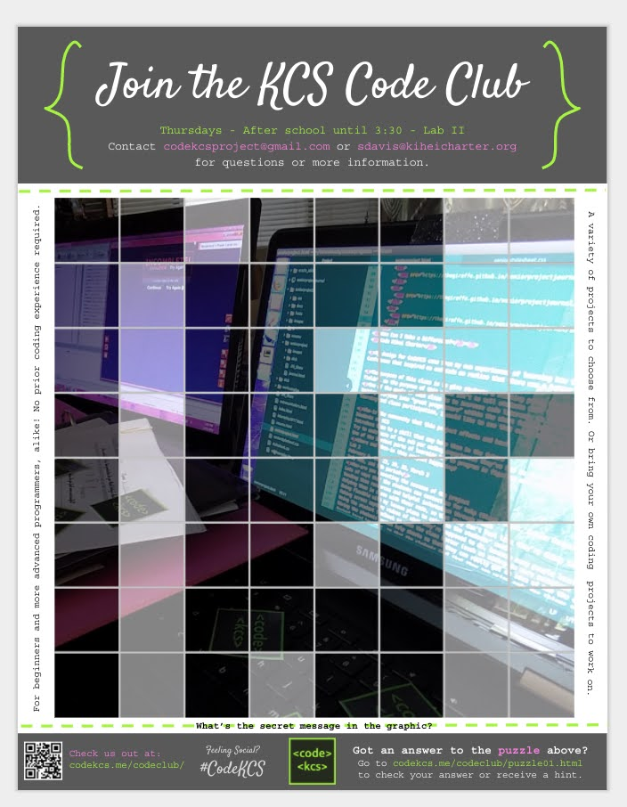
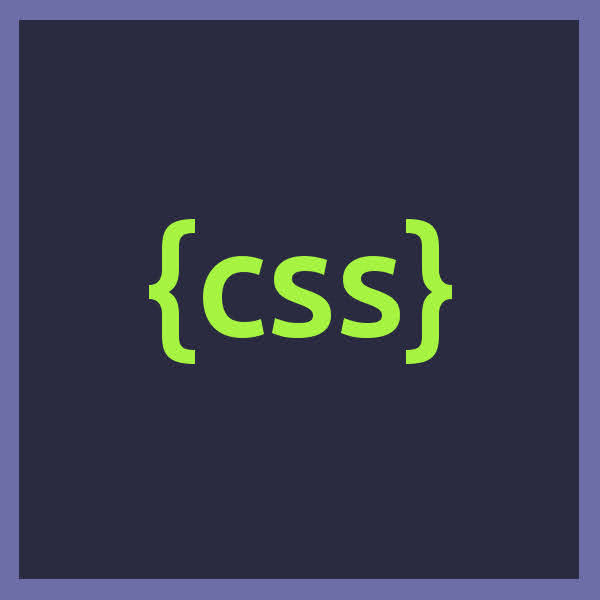
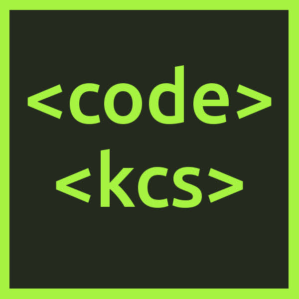
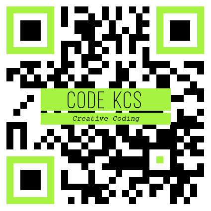
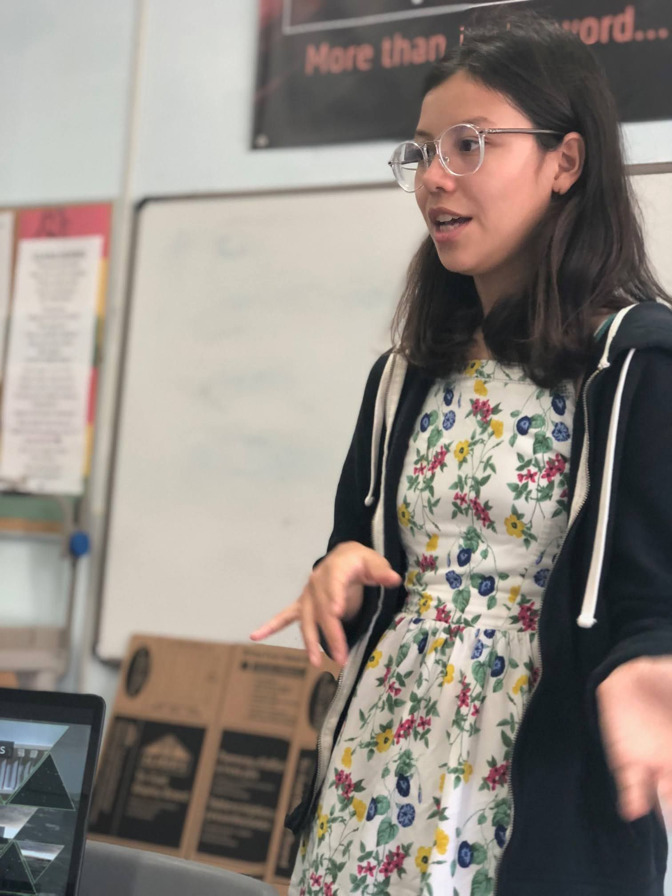

<iframe width="560" height="315" src="https://www.youtube.com/embed/p5lorCKeFW0" title="YouTube video player" frameborder="0" allow="accelerometer; autoplay; clipboard-write; encrypted-media; gyroscope; picture-in-picture" allowfullscreen></iframe>
 Video was filmed, edited, and produced by Christine Davis for Akaku Project YBeam in 2018

## Overview

I taught coding classes at my high school as part of my Senior Project, and then continued to design coding curriculum afterward. This project involved teaching four weeks of coding classes (six classes total) to the Sophomore engineering class. Outside of the class, I tried to increase code literacy at my school by creating a KCS Code Club, as well as designing and distributing a "KCS Code Zine" publication that focused on Creative Programming. I designed and printed lots of qr code stickers linking to the CodeKCS website and put them in the front office for people to take and scan. I also designed fliers to advertise the Code Club, and built and designed the CodeKCS website from scratch with HTML/CSS/JS to showcase learning resources.

<iframe id="issue01" width="720" height="480" src="//e.issuu.com/embed.html#34233579/63762773" allowfullscreen="" frameborder="0"></iframe>

 <iframe title="binaryabacus" frameborder="0" allowfullscreen mozallowfullscreen="true" webkitallowfullscreen="true" allow="autoplay; fullscreen; xr-spatial-tracking" xr-spatial-tracking execution-while-out-of-viewport execution-while-not-rendered web-share width="720" height="480" src="https://sketchfab.com/models/786d736700a04612b8ce9ebf31d4e038/embed?autostart=1&camera=0"> </iframe> 
 <a href="https://sketchfab.com/3d-models/binaryabacus-786d736700a04612b8ce9ebf31d4e038?utm_medium=embed&utm_campaign=share-popup&utm_content=786d736700a04612b8ce9ebf31d4e038" target="_blank" style="font-weight: bold; color: #1CAAD9;"> binaryabacus </a> by <a href="https://sketchfab.com/thegiraffe?utm_medium=embed&utm_campaign=share-popup&utm_content=786d736700a04612b8ce9ebf31d4e038" target="_blank" style="font-weight: bold; color: #1CAAD9;"> TheGiraffe </a> on <a href="https://sketchfab.com?utm_medium=embed&utm_campaign=share-popup&utm_content=786d736700a04612b8ce9ebf31d4e038" target="_blank" style="font-weight: bold; color: #1CAAD9;">Sketchfab</a>

## Design Process

