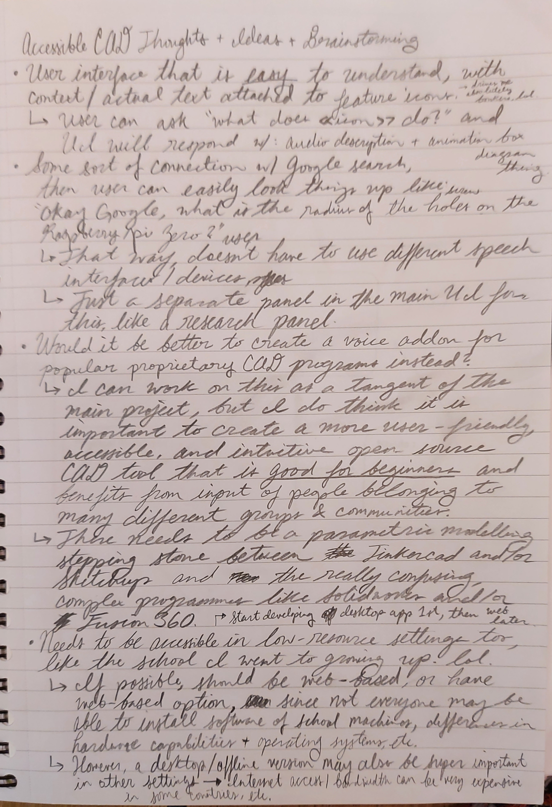

My "dream" project is to design and deploy an accessible open-source CAD software, essentially a speech-to-CAD program that uses verbal commands with NLP instead of the human having to interact using traditional peripherals (mouse, keyboard, etc). I think this is exceptionally important, particularly for the field of biomedical engineering, because we have significant problems where non-disabled engineers are designing products to be used by people with disabilities without having much understanding of their target audience's needs. This sometimes results in large sums of money being spent on a product that ends up not being utilized in real-world settings (or worse, utilized but detrimentally for the patient). Thus, I would like to see more engineers from more diverse backgrounds, including engineers who have disabilities that would make using traditional CAD software quite difficult, designing and leading these projects. I would like the software to be open-source, so that people from many communities can contribute to it - including contributing feature requests, ideas, concerns, code, personal experiences, and everything in-between.

### Preparation:
- [ ] Finish **Open Source Software Development, Linux and Git** Specialization by The Linux Foundation, to learn how to effectively develop and manage an Open Source Software project.
  - [x] Course 1: Open Source Software Development Methods :star:
  - [ ] Course 2: Linux for Developers
  - [ ] Course 3: Linux Tools for Developers
  - [ ] Course 4: Using Git for Distributed Development
- [ ] Use [OSS Watch Tool](http://oss-watch.ac.uk/apps/licdiff/) to figure out which open source license to use for the project.
  - (*Leaning towards GNU General Public License v3.0*)
- [ ] Complete the **Introduction to Accessibility and Inclusive Design** Course by The University of Illinois at Urbana-Champaign

### Some Brainstorming Notes:
*Poor quality as it was taken rather quickly with my phone camera. Will probably clean up, transcribe, and elaborate on later.*

